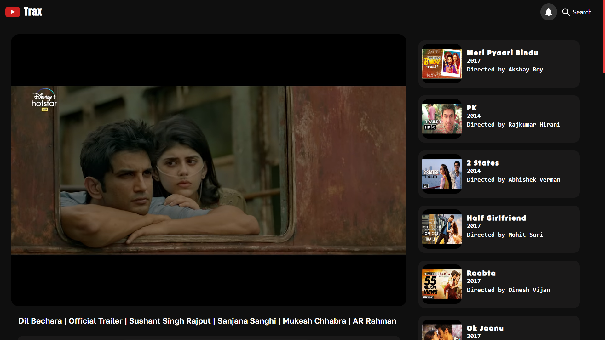
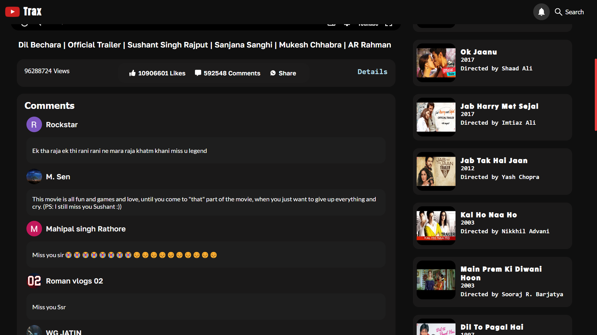
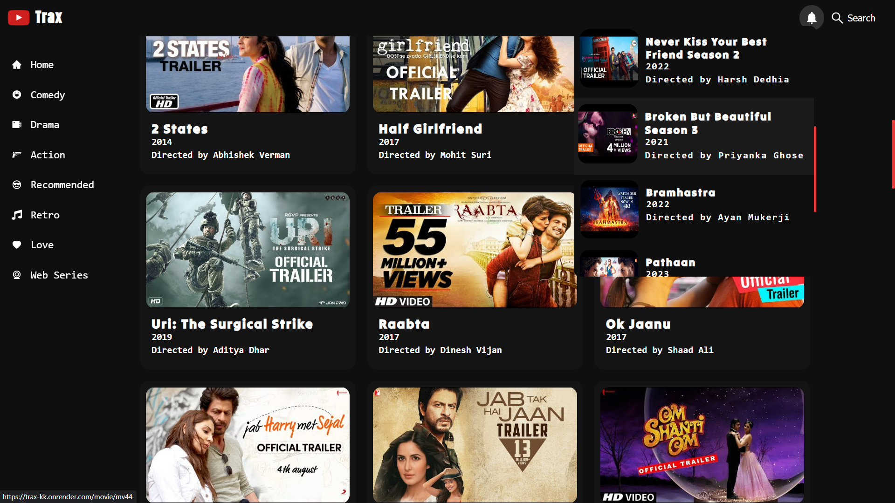
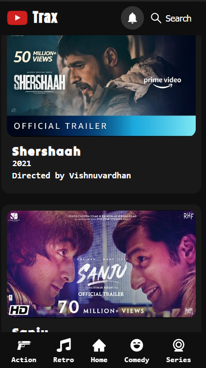

# TRAX

### Live On

https://traxk.vercel.app/

#### Demo Video
https://youtu.be/fKjd732pvM0

## Authors

- [@ikarthik21](https://github.com/ikarthik21)

## Project Overview
This project is a Youtube clone. I built this with React.js.I used the YouTube Data API to fetch movie trailers, comments, likes.

 

## Run Locally

Clone the project

```bash
  git clone https://github.com/ikarthik21/Trax.git
 
```


Install dependencies

```bash
  npm install
```

 

Start the server

```bash
  npm run Start
```


## Screenshots
 


 


 

 

 


 
 
